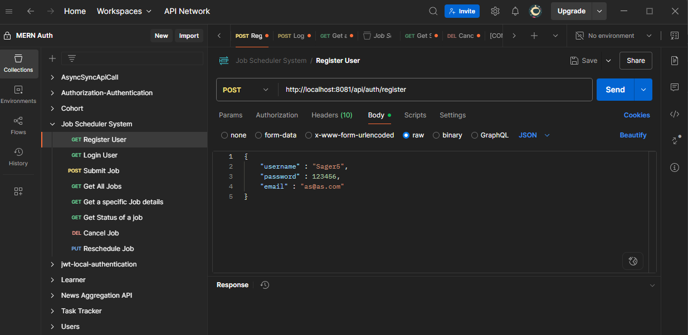
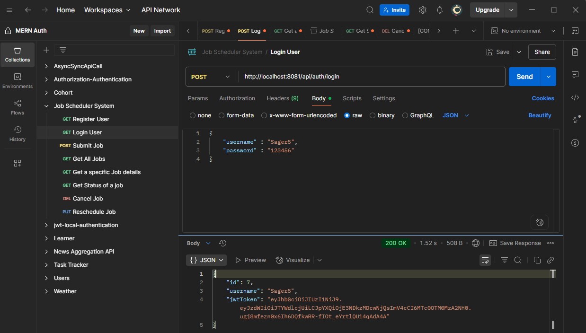
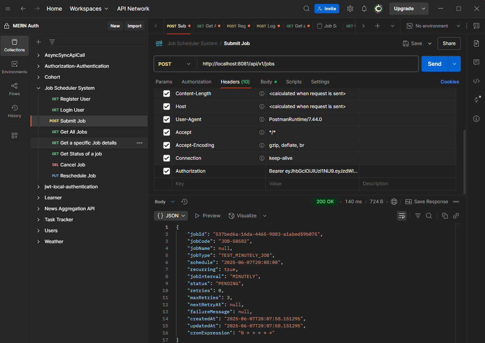
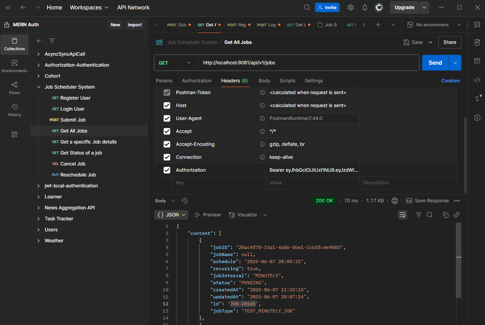
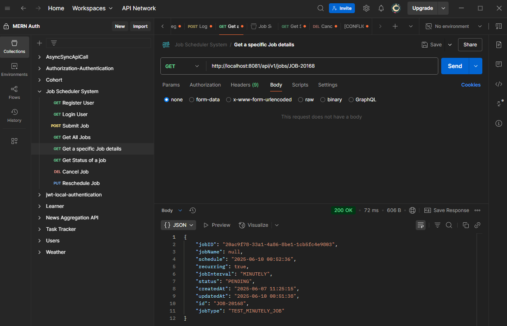
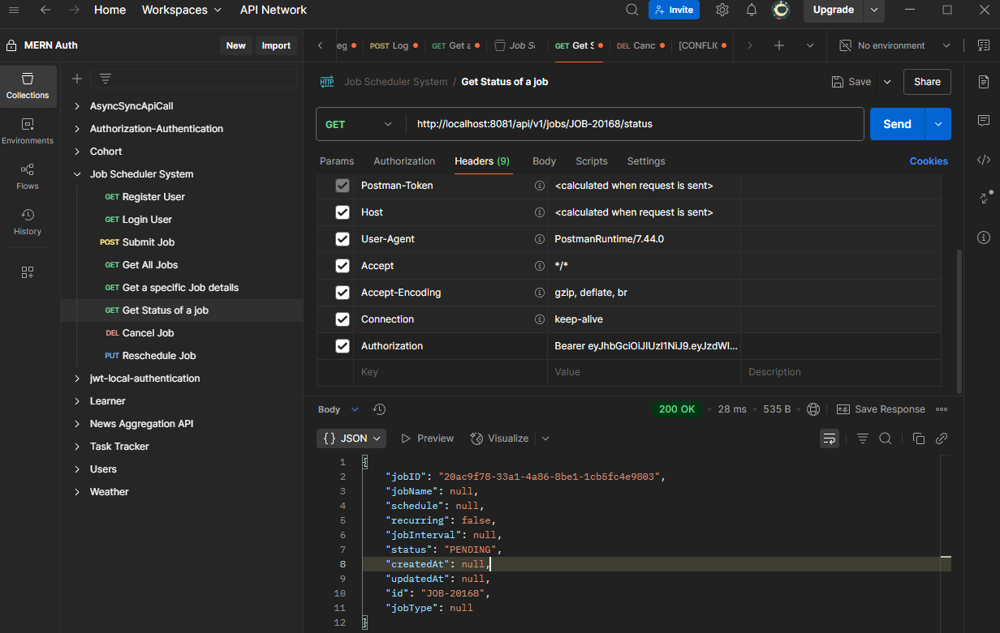
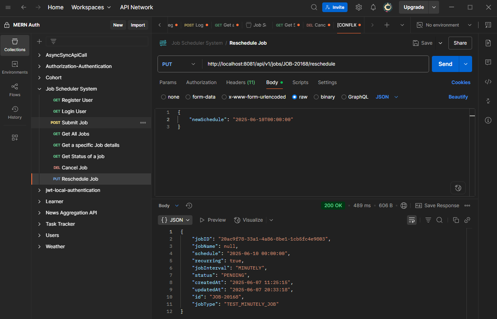
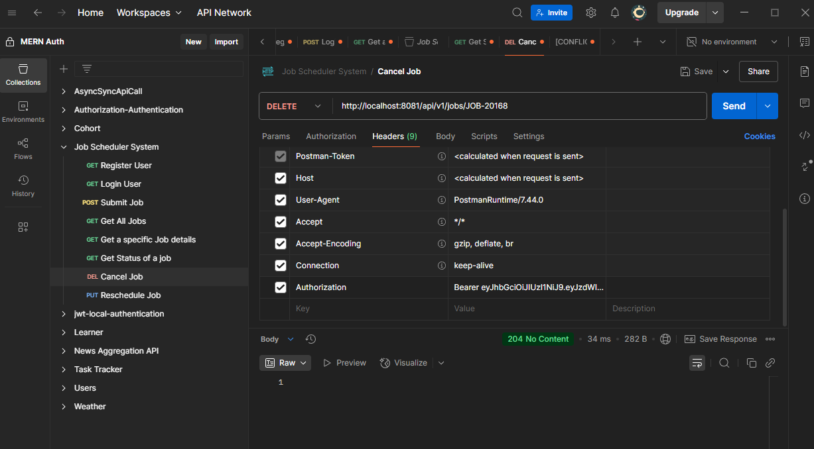
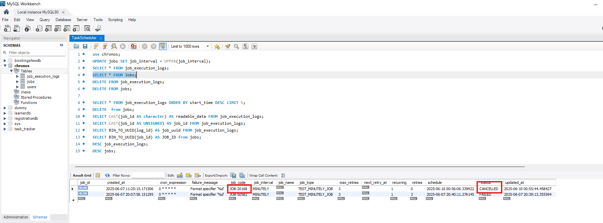
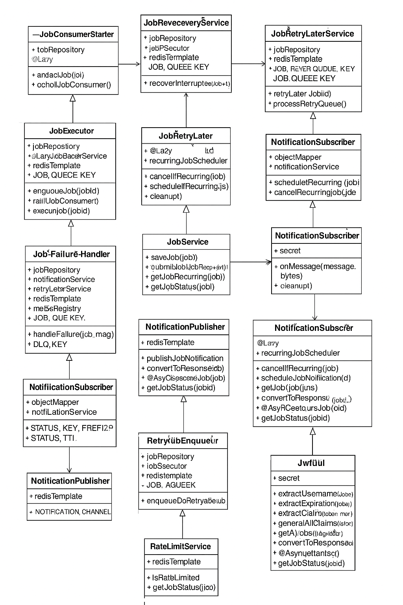

# 🚀 Job Scheduler System 
A scalable and resilient background job scheduling and execution system built with **Java Spring Boot**, **MySQL**, **Redis**, and **Micrometer**. Supports both one-time and recurring jobs, failure handling with retries, rate limiting, job monitoring, and notification services.

---

## 📚 Features

- ✅ Submit and schedule background jobs
- 🔁 Recurring job execution using Cron expressions
- 💥 Automatic failure handling and retries
- 🧵 Asynchronous job processing with thread pools
- 🔒 Distributed locking (Redis) to prevent duplicate execution
- 📉 Monitoring with Micrometer
- ⚠️ Rate limiting per client IP
- 📩 Real-time notifications
- 🧪 REST APIs with Swagger UI

---

## 🛠️ Tech Stack

| Layer             | Technology               |
|-------------------|--------------------------|
| Language          | Java 22+                 |
| Framework         | Spring Boot              |
| Database          | MySQL                    |
| Caching/Queue     | Redis                    |
| Scheduling        | Spring TaskScheduler     |
| Monitoring        | Micrometer + Prometheus  |
| API Docs          | SpringDoc OpenAPI        |
| Build Tool        | Gradle / Maven           |

---

## 🧩 Architecture Overview

- **Job Controller**: REST API to manage jobs
- **Job Executor**: Responsible for executing jobs from Redis queue
- **Job Failure Handler**: Handles failed jobs and pushes them to Dead Letter Queue (DLQ)
- **Recurring Job Scheduler**: Manages recurring job scheduling with cron support
- **Redis Queue**: Used for job queuing and retry mechanism
- **Notification Service**: Sends notifications to users (via Redis pub/sub)
- **Jwt Authentication**: provides JWT token generation and validation utilities

---
## 📬 REST API Endpoints

| Method | Endpoint                          | Description                     |
|--------|-----------------------------------|---------------------------------|
| POST   | `/api/v1/jobs`                    | Submit a new job                |
| GET    | `/api/v1/jobs`                    | Get all jobs (paginated)        |
| GET    | `/api/v1/jobs/{jobId}`            | Get job by ID                   |
| GET    | `/api/v1/jobs/{jobId}/status`     | Get job status                  |
| PUT    | `/api/v1/jobs/{jobId}/reschedule` | Reschedule a job                |
| DELETE | `/api/v1/jobs/{jobId}`            | Cancel a job                    |

---
## 📬 API Examples (via Postman)

### Register User

### Login User

### Submit Job Request

### Get all Jobs

### Get specific job details

### Get Job Status

### Reschudle Job

### Cancel Job

---

## 📌 UML Diagram

---
## 🤝 Contributing
- Pull requests are welcome. For major changes, please open an issue first to discuss.

---
## 👨‍💻 Author
- Sagar Medtiya
